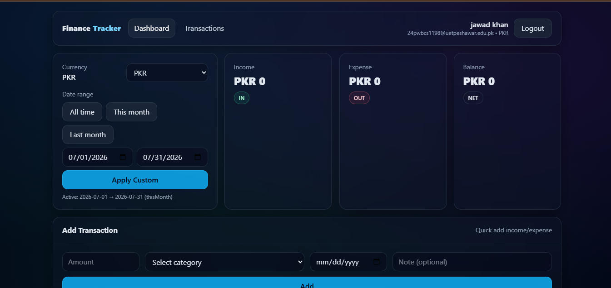
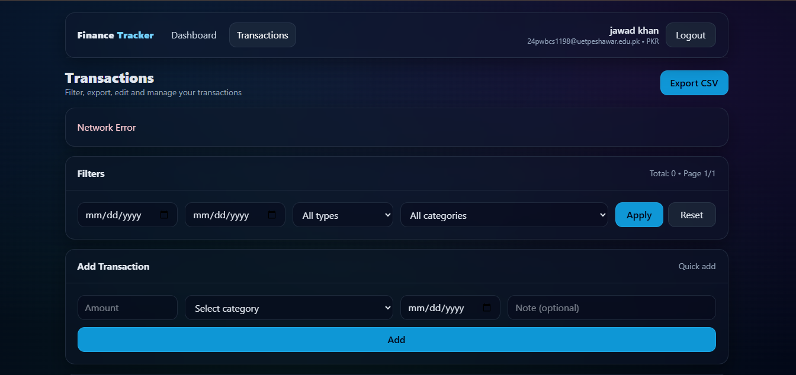

# 💰 Finance Tracker

A full-stack personal finance tracker where users can register, log in, and manage their income & expense transactions with a live dashboard summary.

## 🌐 Live Demo
- **Frontend:** _coming soon (Vercel)_
- **Backend API:** _coming soon (Render)_

## ✨ Features
- User **register / login / logout**
- **JWT authentication** (protected routes)
- Add / edit / delete **transactions** (income & expense)
- **Dashboard** with balance, total income & total expense
- Category-based tracking
- Persistent storage with **MongoDB**

## 🛠️ Tech Stack
**Frontend:** React, Vite, Context API, Axios, CSS
**Backend:** Node.js, Express.js, Mongoose (MongoDB), JWT, bcrypt
**Database:** MongoDB Atlas
**Deployment:** Vercel (frontend) · Render (backend)

## 📁 Project Structure
```txt
FINANCE-TRACKER/
├── backend/
│   └── src/
│       ├── controllers/
│       ├── db/
│       ├── middlewares/
│       ├── models/
│       ├── routes/
│       ├── utils/
│       ├── app.js
│       ├── constants.js
│       └── index.js
├── frontend/
│   └── vite-project/
│       └── src/
│           ├── components/
│           ├── context/
│           ├── hooks/
│           ├── pages/
│           ├── services/
│           └── utils/
└── README.md
```

## 🔐 Environment Variables
Real secrets live in `.env` files (ignored by git). Templates are provided:
- `backend/.env.example`
- `frontend/vite-project/.env.example`

Copy each `.env.example` → `.env` and fill in your own values before running.

## 🚀 Run Locally

### 1) Backend
```bash
cd backend
npm install
cp .env.example .env      # then fill in your values
npm run dev
```
Backend runs at `http://localhost:5000`

### 2) Frontend
```bash
cd frontend/vite-project
npm install
cp .env.example .env      # then fill in your values
npm run dev
```
Frontend runs at `http://localhost:5173`

## 📸 Screenshots

### Dashboard


### Transactions
